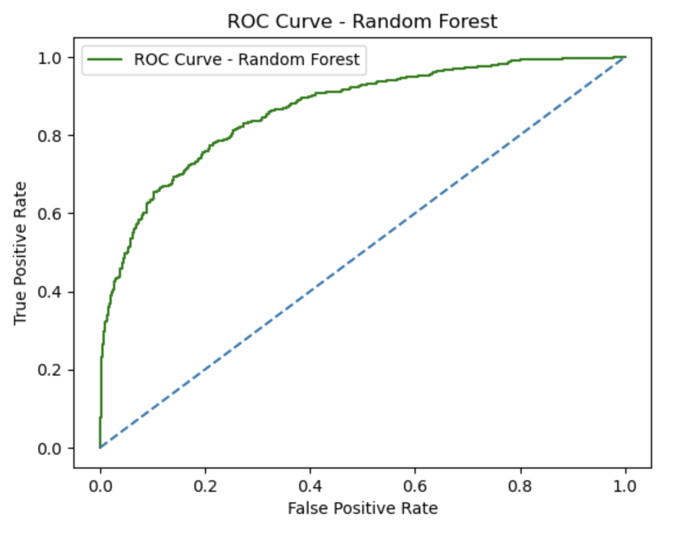
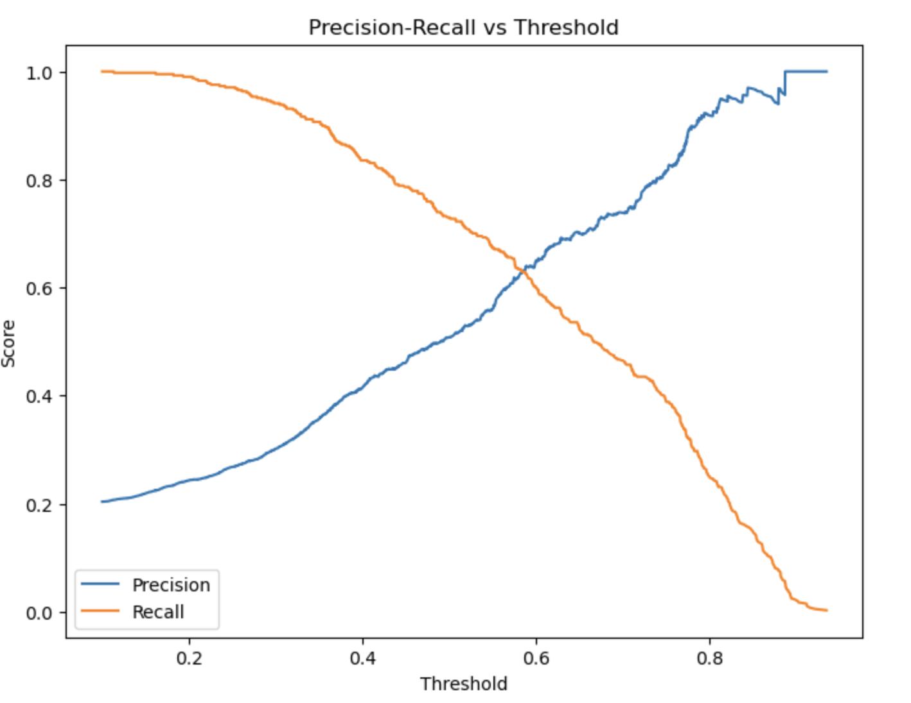
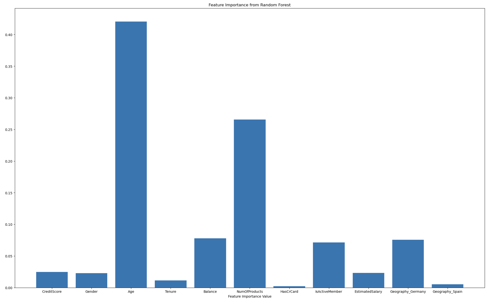

# 🏦 Banka Müşteri Terk (Churn) Analizi ve Tahminlemesi


> **"Mevcut müşteriyi elde tutmak, yeni bir müşteri kazanmaktan 5 ila 25 kat daha az maliyetlidir." - Harvard Business Review**

Bu proje, bankacılık sektöründeki en kritik iş problemlerinden biri olan **Müşteri Kaybı (Churn)** sorununu ele almaktadır. 10.000 müşteriye ait demografik, finansal ve davranışsal veriler kullanılarak, müşterilerin bankayı terk etme olasılıklarını tahmin eden makine öğrenmesi modelleri geliştirilmiştir. Proje, ham veriden başlayıp model optimizasyonuna kadar uzanan uçtan uca bir veri bilimi sürecini kapsar.

---

## 🎯 Proje Amacı ve İş Problemi
Bankalar için müşterilerin neden hizmeti bıraktığını anlamak ve potansiyel kayıpları önceden tespit etmek hayati önem taşır. Bu projenin temel amaçları:
* Bankayı terk etme eğiliminde olan müşterileri yüksek doğrulukla tahmin etmek.
* Müşteri kaybına neden olan temel faktörleri (Feature Importance) belirlemek.
* Bankanın pazarlama ve müşteri ilişkileri departmanlarına aksiyon alabilecekleri içgörüler sunmak.

---

## 📊 Veri Seti ve Değişkenler
Analizde kullanılan veri seti, 10.000 gözlem ve 14 değişken içermektedir.

| Değişken | Tip | Açıklama |
| :--- | :--- | :--- |
| `CreditScore` | Sayısal | Müşterinin kredi skoru. |
| `Geography` | Kategorik | Müşterinin yaşadığı ülke (Fransa, Almanya, İspanya). |
| `Gender` | Kategorik | Müşterinin cinsiyeti. |
| `Age` | Sayısal | Müşterinin yaşı. |
| `Tenure` | Sayısal | Müşterinin bankada geçirdiği yıl sayısı. |
| `Balance` | Sayısal | Müşterinin hesap bakiyesi. |
| `NumOfProducts` | Sayısal | Müşterinin kullandığı banka ürünü sayısı (kredi kartı, kredi vb.). |
| `HasCrCard` | Kategorik | Kredi kartı sahipliği (1: Evet, 0: Hayır). |
| `IsActiveMember` | Kategorik | Aktif müşteri durumu (1: Evet, 0: Hayır). |
| `EstimatedSalary` | Sayısal | Müşterinin tahmini yıllık maaşı. |
| **`Exited`** | **Hedef (Target)** | **Müşteri bankayı terk etti mi? (1: Evet, 0: Hayır)** |

> **Not:** `RowNumber`, `CustomerId` ve `Surname` gibi modelleme için anlamsız olan kimlik bilgileri analizden çıkarılmıştır.

---

## 🔍 Keşifçi Veri Analizi (EDA)
Veriyi anlamak için yapılan analizlerde şu bulgulara ulaşılmıştır:
* **Dengesiz Veri Seti (Imbalanced Data):** Hedef değişken `Exited` incelendiğinde, müşterilerin yaklaşık %80'inin kaldığı, %20'sinin ise ayrıldığı görülmüştür. Bu durum modellemenin `accuracy` yerine `recall` veya `AUC` odaklı yapılmasını gerektirmiştir.
* **Yaş Faktörü:** Bankayı terk eden müşterilerin yaş ortalamasının, kalanlara göre belirgin şekilde daha yüksek olduğu gözlemlenmiştir.
* **Coğrafi Farklılıklar:** Almanya'daki müşterilerin terk etme oranının, Fransa ve İspanya'ya göre daha yüksek olduğu tespit edilmiştir.

---

## 🛠 Veri Ön İşleme ve Özellik Mühendisliği
Model performansını maksimize etmek için veriye şu işlemler uygulanmıştır:

1.  **Gereksiz Değişkenlerin Temizlenmesi:** Analitik değeri olmayan sütunlar drop edildi.
2.  **Encoding (Kodlama):**
    * `Gender` değişkeni için **Label Encoding** (Kadın: 0, Erkek: 1).
    * `Geography` değişkeni için **One-Hot Encoding** (Her ülke için ayrı sütunlar oluşturuldu).
3.  **Veri Bölme (Splitting):** Veri seti %80 Eğitim (Train) ve %20 Test (Test) olarak ayrıldı. Ayrım sırasında hedef değişkenin dağılımını korumak için `stratify=y` kullanıldı.
4.  **Ölçeklendirme (Scaling):** Tüm sayısal değişkenler (Age, Balance, EstimatedSalary vb.) `StandardScaler` kullanılarak standartlaştırıldı. Bu işlem, özellikle Lojistik Regresyon gibi mesafe temelli algoritmaların performansı için kritiktir.

---

## 🤖 Modelleme Stratejisi
Projede hem lineer hem de ağaç tabanlı (tree-based) algoritmalar kullanılarak kapsamlı bir kıyaslama yapılmıştır:

* **Logistic Regression:** Temel (Baseline) model olarak kullanıldı. İlişkilerin doğrusallığını test etmek için seçildi.
* **Decision Tree Classifier:** Verideki karar kurallarını ve kırılımları görmek için denendi.
* **Random Forest Classifier:** Bagging yöntemiyle çalışan güçlü bir ensemble modeldir. Özellikle dengesiz veri setinde `class_weight="balanced"` parametresi ile azınlık sınıfını (Churn) daha iyi öğrenmesi sağlandı.
* **XGBoost Classifier:** Gradient Boosting tabanlı, yüksek performanslı ve modern bir algoritmadır. Modelin tahmin gücünü artırmak için kullanıldı.
* **Dummy Classifier:** Diğer modellerin başarısının şans eseri olmadığını kanıtlamak için referans model olarak eklendi.

---

## 🏆 Model Değerlendirmesi ve Sonuçlar

Modellerin başarısı **Accuracy, Precision, Recall, F1-Score** ve **ROC-AUC** metrikleri ile ölçülmüştür. Dengesiz veri setlerinde sadece Accuracy'ye bakmak yanıltıcı olabileceğinden, **AUC (Area Under Curve)** skoru ana başarı kriteri olarak belirlenmiştir.

| Model | Accuracy | AUC Score | Precision (1) | Recall (1) | F1-Score (1) |
| :--- | :---: | :---: | :---: | :---: | :---: |
| **Random Forest** | **%86.3** | **0.864** | 0.76 | 0.49 | 0.61 |
| XGBoost | %85.0 | 0.832 | 0.68 | 0.48 | 0.56 |
| Logistic Regression | %81.0 | 0.775 | 0.59 | 0.19 | 0.28 |
| Decision Tree | %74.0 | 0.670 | 0.43 | 0.75 | 0.54 |

> **Karar:** **Random Forest** modeli, hem genel doğruluk hem de AUC skoru bakımından en başarılı model olmuştur.

<br>

### ROC Eğrisi (Random Forest)
Random Forest modelinin sınıflandırma performansı (AUC: 0.86), sol üst köşeye yakınlığı ile başarısını göstermektedir.



### Eşik Değeri (Threshold) Optimizasyonu
Varsayılan 0.5 eşik değeri, potansiyel kayıpları (Churn) yakalamada bazen yetersiz kalabilir. Aşağıdaki grafikte görüldüğü üzere, **Recall** değerini artırmak (daha fazla churn müşterisi yakalamak) için eşik değeri düşürülmelidir. Bu projede eşik değeri **0.3** olarak optimize edilmiştir.



---

## 📈 Önemli Bulgular ve İçgörüler

### Özellik Önemi (Feature Importance)
Random Forest modeline göre, bir müşterinin bankayı terk edip etmeyeceğini belirleyen en önemli faktörler şunlardır:

1.  **Age (Yaş):** En belirleyici faktör.
2.  **NumOfProducts (Ürün Sayısı):** Banka ile ürün ilişkisi derinliği.
3.  **Balance (Bakiye):** Müşterinin hesap bakiyesi.



---

## 💻 Kurulum ve Çalıştırma

Projeyi kendi bilgisayarınızda çalıştırmak için aşağıdaki adımları izleyebilirsiniz:

1.  **Repoyu Klonlayın:**
    ```bash
    git clone [https://github.com/kullanici_adiniz/bank-churn-prediction.git](https://github.com/kullanici_adiniz/bank-churn-prediction.git)
    cd bank-churn-prediction
    ```

2.  **Sanal Ortam Oluşturun (Opsiyonel ama önerilir):**
    ```bash
    python -m venv venv
    source venv/bin/activate  # Mac/Linux
    venv\Scripts\activate     # Windows
    ```

3.  **Gereksinimleri Yükleyin:**
    ```bash
    pip install -r requirements.txt
    ```
    *(Eğer requirements.txt yoksa: `pip install pandas numpy matplotlib seaborn scikit-learn xgboost`)*

4.  **Jupyter Notebook'u Başlatın:**
    ```bash
    jupyter notebook Churn_Analysis.ipynb
    ```

---
